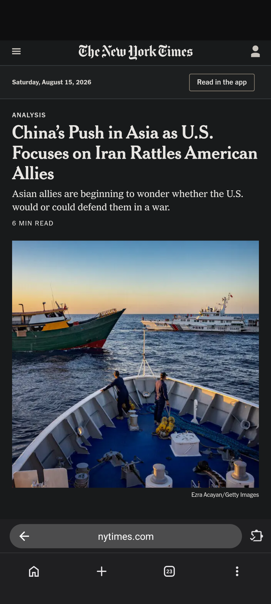
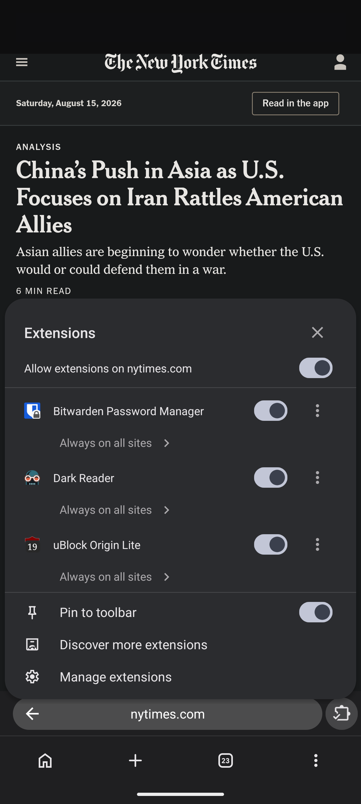
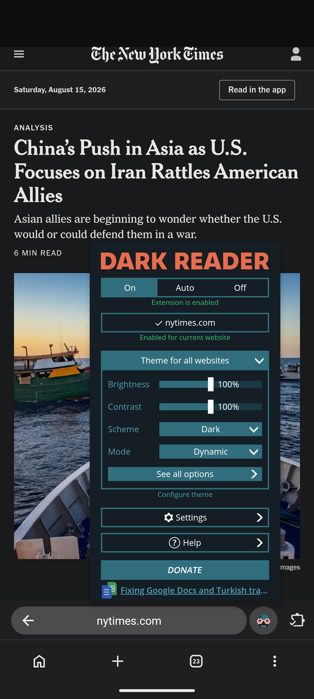
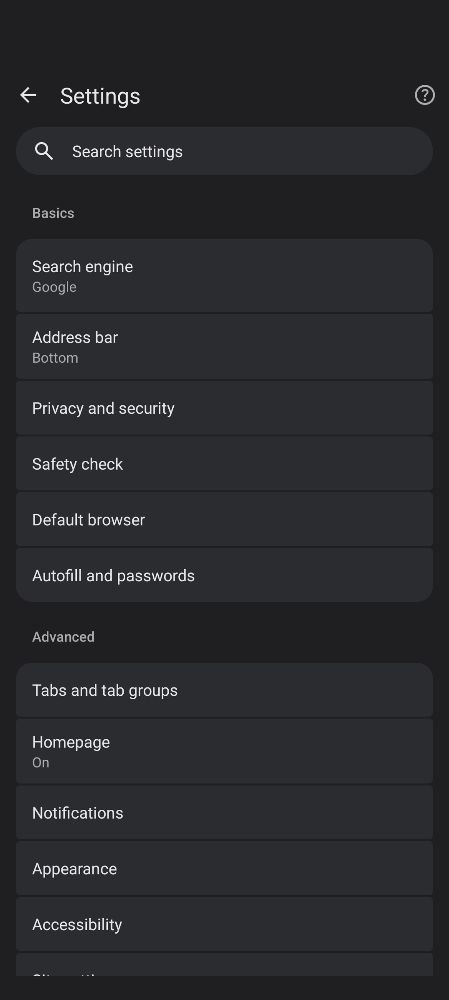

# Chromium Extend 

A small patch series for **Chromium Desktop Android** that removes Google tracking,
telemetry, and AI integration while keeping browser extensions and video playback working.

Built and used on a Pixel 10 Pro XL. Not affiliated with Google or the Chromium project.

- **Base:** Chromium `153.0.7999.0` (commit `945b5115`)
- **Target:** `is_desktop_android = true`, `target_cpu = "arm64"`
- **Size:** 29 patches, 793 insertions across 44 files

## What you get

**🧩 Real browser extensions on your phone.** Password managers, ad blockers, dark mode — the same
extensions you'd use on a desktop. Tap an extension's icon and its window opens properly, and you
can pin the ones you use most to the toolbar.

**🔗 Links open in the browser, not in apps.** Tapping a Reddit or YouTube result keeps you in the
browser instead of throwing you into their app mid-read. Phone numbers and email links still open
the right app, as they should.

**📵 De-Googled!** No background check-ins to Google, and nothing about the forms you fill in gets
sent off for analysis. Google's built-in AI features are removed entirely, not just switched off.

**🦆 DuckDuckGo out of the box.** The shipped default on a new profile, not something you have to
go and change. The new tab page follows it, so the Google logo is gone too.

**🧹 No dead Google UI.** Settings opens straight to what you can actually change — no sign-in
prompts, no Google services page, no password manager row that only says it stopped working. No
first-run sign-in screen either: it opens straight to a new tab.

**🎬 Video still works, and fullscreen behaves.** Ordinary video plays, and so does paid streaming
like Netflix and Spotify — usually the first thing to break in a privacy-focused browser. Fullscreen
respects your rotation lock instead of forcing landscape, and fills the screen properly rather than
sitting off-centre next to the camera cutout.

**🛡️ Still safe to browse.** Protections against fake certificates and downgraded connections are
deliberately kept. Privacy here doesn't come at the cost of security.

**🐛 Two crashes fixed.** The stock build crashes when you open an extension's window, and again if
you tap sign-in. Both are fixed.

## Screenshots

| | |
| --- | --- |
|  |  |
| **Extension icons in the toolbar.** Pinned extensions sit beside the address bar. | **The extensions menu on a phone.** Per-site permissions and *Pin to toolbar* — upstream only offers this at tablet widths. |
|  |  |
| **An extension's own window.** Dark Reader running from the toolbar, exactly as on a desktop. | **Settings opens straight to Basics.** No sign-in row, no Google services page. |

## Why

Chromium's Desktop Android build supports real browser extensions, which mobile Chrome does
not. That makes it a genuinely better browser to live in — but it still ships Google's AI
stack, phones home on a schedule, and hands your links to other apps. This series fixes that
without forking anything.

## What the patches do

| # | Patch | Effect |
| --- | --- | --- |
| 0001 | Fix two Desktop Android crashes | Extension popup keyboard events and the sign-in Add Account action both crashed the browser |
| 0002 | Harden extensions menu | The menu action crashed when no toolbar coordinator existed |
| 0003 | Extensions toolbar on phone layouts | Extension icons, popups, and pinning were tablet-only; now available at phone widths |
| 0004 | Remove variations and network-time callbacks | Two periodic requests to Google, sent regardless of activity |
| 0005 | Keep web navigations in the browser | `http(s)` links no longer get handed to whichever app claims the domain |
| 0006 | Stop Autofill crowdsourcing uploads | Form structure was uploaded to Google to train its field-classification heuristics |
| 0007 | Remove the GCM push channel | Google Cloud Messaging services, the c2dm permission and the Firebase receiver |
| 0008 | Guard omnibox vector icon calls | Unblocks disabling the Google XR SDKs, which previously broke the build |
| 0009 | Hide Google Password Manager and sign-in promo | Both were permanently non-functional and advertised as broken |
| 0010 | Remove the "You and Google" settings section | Sign-in and Google services entries, neither of which can work here |
| 0011 | Ignore page requests to lock screen orientation | Fullscreen video forced landscape, overriding the system rotation lock |
| 0012 | Draw fullscreen content into the display cutout | Fullscreen video was letterboxed off the camera edge, leaving it off-centre |
| 0013 | Size fullscreen video to its picture | The seekbar sat at the bottom of the screen instead of on the video |
| 0014 | DuckDuckGo as the default search provider | Google was the shipped default, selected by engine ID rather than list order |
| 0015 | Remove the sign-in first-run screen | Promoted a sign-in this build cannot do, and claimed data is sent to Google |
| 0016 | Stop showing the NTP sign-in card | "Get better content" — sign in to personalise a feed this build cannot use |
| 0017 | Remove the Chrome tips module | A carousel of Google promos: history sync, sign-in, passwords, Safe Browsing |
| 0018 | Never offer the web app restore promo | Restores apps from devices "connected to this account" — impossible here |
| 0019 | Remove the Ask Gemini button | The bottom bar's extra slot resolved to Gemini, which demands account verification |
| 0020 | Remove the avatar sign-in button | "Signed out. Opens options to sign in." on every new tab page |
| 0021 | Stop offering Gemini as a toolbar shortcut | Otherwise the button removed in 0019 could be put back from Settings |
| 0022 | Offer downloads to an installed download manager | Hands a download to an app such as 1DM instead of fetching it in the browser |
| 0023 | Add a setting to choose the download manager | Settings → Downloads, off by default |
| 0024 | Browse the Chrome Web Store as a desktop site | The mobile store has no install button, so extensions could not be installed |
| 0025 | Turn off the AI Mode omnibox button | An AI entry point in the omnibox, on by default |
| 0026 | Hide the shortcuts row and NTP cards by default | Both already had toggles; only the starting state changed |
| 0027 | Lower the search box into thumb reach | Sits around 40% down the page rather than near the top |
| 0028 | Move the tab switcher toolbar to the bottom | Its buttons stayed at the top while the browsing toolbar sits at the bottom |
| 0029 | Pick which download manager receives downloads | Lists installed handlers, or ask every time |

Patches 0001 and 0002 are bug fixes that happen to be prerequisites. 0003 is a usability fix.
0004 through 0010 are the de-Googling, as are 0014 through 0021. 0011 through 0013 fix
fullscreen video behaviour. 0022 and 0023 add the external download manager option. 0024
through 0028 are usability changes: the Web Store, the AI Mode button, what the new tab page
shows by default, and where the toolbars sit.

Sign-in has no single gate in Chromium. Patches 0009, 0010, 0015, 0016 and 0020 each remove a
different entry point — the settings row, the "You and Google" section, the first-run screen,
the New Tab Page card, and the toolbar avatar. Assume there are more rather than fewer.

### Removed by build flag

These go in `args.gn` rather than a patch:

```gn
use_mlkit_for_aicore = false          # ML Kit + AICore (on-device Gemini Nano bridge)
enable_glic_internal_resources = false # Gemini-in-Chrome surface
enable_reporting = false               # Reporting API / Network Error Logging
enable_service_discovery = false       # local device discovery
enable_mdns = false                    # mDNS
```

### What is deliberately kept

| Kept | Why |
| --- | --- |
| Extensions (`enable_extensions_core`) | The entire point of the Desktop Android target |
| Proprietary codecs (`ffmpeg_branding = "Chrome"`) | H.264/AAC video playback |
| Widevine | DRM — removing it breaks paid streaming |
| Component updater | Delivers CRLSet certificate revocation data |
| HSTS preload list | Static security asset, no callback |

## Requirements

- Docker, with at least **32 GB** allocated to the VM. At 16 GB a full build is
  reliably OOM-killed partway through.
- ~100 GB free disk. The Chromium checkout alone is ~50 GB.
- An arm64 Android device for testing.

Builds run in an x86-64 Ubuntu 22.04 container. On Apple Silicon this means Rosetta
emulation, and a full build takes hours.

## Quick start

```bash
./builder.sh build     # build the container image
./builder.sh start     # start it
./builder.sh shell     # get a shell inside
```

Fetch a Chromium checkout at the base commit into the container's `/work/chromium/src`, then
apply the series:

```bash
git am /exchange/patches/*.patch
```

Add the flags above to `out/<name>/args.gn` alongside your platform args, then:

```bash
gn gen out/<name>
autoninja -C out/<name> -j 12 chrome_public_apk
```

See [BUILDING.md](BUILDING.md) for the full workflow, including how files move between the
container and the host.

## Verifying a build

**The build is reproducible.** Building the same source twice produces a byte-identical APK, so
you do not have to trust the published binary — you can rebuild it and compare.

This was measured, not assumed. The same tree was built two ways:

| Build | How | SHA-256 |
| --- | --- | --- |
| `out/PixelFold` | incremental, with a day of history including an applied-then-reverted patch | `19577669…fb492d48` |
| `out/Verify` | clean, from nothing, in a differently-named directory | `19577669…fb492d48` |

Identical hashes, identical size, from a 6h15m clobber build against an incremental one. The
differing directory name matters: a build path leaking into a binary is the most common cause of
irreproducibility, and Chromium's [deterministic build
support](https://chromium.googlesource.com/chromium/src/+/main/docs/deterministic_builds.md)
holds here. Two other things that usually break Android reproducibility are already handled
upstream — every zip entry is stamped `2001-01-01 00:00` rather than build time, and the APK is
signed with `build/android/chromium-debug.keystore`, which is checked into Chromium's tree and
used by default, so signatures match too.

### To verify a build yourself

1. Check out Chromium at base commit `945b5115`
2. Apply the series: `git am patches/*.patch`
3. Use the `args.gn` shown above
4. `gn gen out/<name> && autoninja -C out/<name> -j 12 chrome_public_apk`
5. `sha256sum out/<name>/apks/ChromePublic.apk`

A rebuild from the same commit should give the same hash as a release built from that commit.

### What this does and does not prove

**Proven:** the build is deterministic in this container — directory names, build history, and
clobber-versus-incremental do not change the output.

**Not yet proven:** that a rebuild on *different* hardware, or in a container built at a
different time, produces the same bytes. `docker/Dockerfile` starts from `ubuntu:22.04` and
installs packages with `apt-get`, so the image drifts as upstream packages change. Chromium
ships a hermetic toolchain through `DEPS`, so the host package set most likely does not affect
the output — but that link is untested here, and a reproducibility claim is the wrong place for
"most likely". If you rebuild on your own machine and get a different hash, please open an issue;
that is the missing measurement.

### Release hashes

Published APKs are signed with the same checked-in debug key, so they are not unique to this
machine.

| Release | SHA-256 |
| --- | --- |
| v1.2 | `8fe506d5e89da5a8c4c8feff0e74d8151334ee820eccf1223ca4a044ddfb6d33` |

The v1.2 hash is published for download integrity — it confirms the file you fetched is the file
that was uploaded. On its own it is self-attested and proves nothing about provenance; the
rebuild above is what does that. v1.2 was built from the 21-patch tree, before the reproducibility
test was run, so it has not itself been rebuilt and compared. Future releases will publish a hash
verified against a clean rebuild.

## Status

**Verified on device.** No crashes across a full session. Extensions install and run
(Bitwarden, uBlock Origin Lite, Dark Reader, Bypass Paywalls Clean), popups open, pinning
works. Both original crash reproductions are gone. The shipped `AndroidManifest.xml` contains
zero references to ML Kit or AICore.

Patch 0005 is confirmed against a real in-page link tap: following a Reddit result from a search
page keeps you in the browser, with Reddit's own "Open App" prompt left unused.

Patches 0011 and 0012 are confirmed on device: fullscreen video follows the phone's orientation
instead of forcing landscape, and sits centred in both portrait and landscape. 0013 is confirmed
by geometry read off the running page, for both a 16:9 video and one taller than the viewport.

Patches 0014 and 0015 are confirmed on a **wiped profile**, which is the only honest test for
either: the new tab page shows DuckDuckGo and a query resolves to `duckduckgo.com`, and the
browser opens straight to the new tab page with no first-run screen — including after a force
stop and relaunch, which is what fails if the Terms of Service acceptance does not persist.

**Not fully verified.** Widevine is *detected* — a DRM test page reports `widevine` as the
available key system — but actual protected playback has not been exercised end to end.

## Known limitations

- **Extension popups can be cropped.** Extensions auto-size their popup to content and may
  request a width wider than a phone screen. `kMaxSize` in
  `chrome/browser/ui/android/extensions/extension_action_popup_contents.cc` is hardcoded to
  800dp. Two attempts to bound it failed; the second stopped popups rendering entirely, so
  both were reverted. Needs instrumenting rather than guessing.
- **The omnibox is squeezed** when several extensions are pinned. `ToolbarPhone` has none of
  the `ToolbarWidthConsumer` negotiation `ToolbarTablet` uses. Unpinning all but one extension
  works around it.
- **Patch 0005 is blunt.** All `http(s)` navigations stay in the browser. Some OAuth flows and
  deep links legitimately expect an app handoff and will no longer get one. Explicit schemes
  (`intent://`, `tel:`, `mailto:`, `sms:`) are untouched.
- **The DuckDuckGo default only applies to new profiles.** Patch 0014 seeds the default at
  first run. An existing profile has `kDefaultSearchProviderData` persisted and
  `DefaultSearchManager` prefers it, so upgrading over an older install keeps Google until you
  change it in Settings → Search engine.
- **The New Tab Page still has Discover.** The Google logo, the promo cards and the AI Mode
  button are gone; Discover remains.
- **External downloads lose your sign-in.** With "Use an external download manager" on, a file
  that requires you to be signed in will fail in the other app: the interception point in
  `ChromeDownloadManagerDelegate` carries no cookie. Passing credentials needs a different
  interception layer, not an extra argument. The setting's own summary says so.
- **Passkeys (WebAuthn) do not work.** `Fido.FIDO2_PRIVILEGED_API` is restricted to
  Google-signed browsers, so a self-built Chromium is refused with `ApiException: 17`. This is
  inherent to building Chromium yourself, not caused by any patch here — verified by
  reproducing it on an earlier build.
- **Web Push is gone**, as a consequence of removing the GCM channel in patch 0007.

## Not done yet

Each has an exact file and line reference in [docs/stage-1-2.md](docs/stage-1-2.md):

- Safe Browsing — blocked by one un-gated call site in the Android JNI bridge
- Google XR SDKs (ARCore, Cardboard, VrCore, OpenXR) — blocked by three omnibox call sites;
  the flags are coupled in both directions and there is no GN-only configuration that works
- `build_with_model_execution`, `enable_supervised_users`, `enable_offline_pages` — each
  blocked by a single GN `assert()`
- The New Tab Page still carries an AI Mode button and Discover. Its Google logo is gone as a
  side effect of 0014 — the NTP logo follows the default search engine
- ARCore, Cardboard and Daydream manifest entries persist from library manifests, though their
  code is gone

### Already inert — no work needed

Worth knowing before anyone patches them: a public (non-Chrome-branded) Chromium build already
sends no usage metrics, no URL-keyed metrics and no crash reports, because upstream withholds
those endpoints from forks. Translate is likewise disabled without a Google API key. Details and
evidence are in [docs/stage-1-2.md](docs/stage-1-2.md).

## Repository layout

```
patches/            the patch series, applied in order
docker/             container image definition
docker-compose.yml  build environment
builder.sh          container wrapper
assets/             logo used in this README
docs/design.md      design decisions and rationale
docs/stage-1-2.md   execution notes, diagnoses, and results
```

The Chromium checkout, build output, and APKs are not tracked — they live in a Docker volume
and would be far past GitHub's file size limits.

## License

The patches modify Chromium source and are therefore subject to Chromium's
**BSD-3-Clause** license. See the
[Chromium LICENSE](https://chromium.googlesource.com/chromium/src/+/main/LICENSE).

`assets/chromium-logo.svg` is from
[Wikimedia Commons](https://commons.wikimedia.org/wiki/File:Chromium_Logo.svg), in the public
domain under `PD-textlogo` (simple geometric shapes, below the threshold of originality).
Public domain covers copyright only — the mark itself remains a trademark, and it is used here
to identify the upstream project this patches, not to suggest endorsement.

Chromium is a trademark of Google LLC. This project is unaffiliated.
