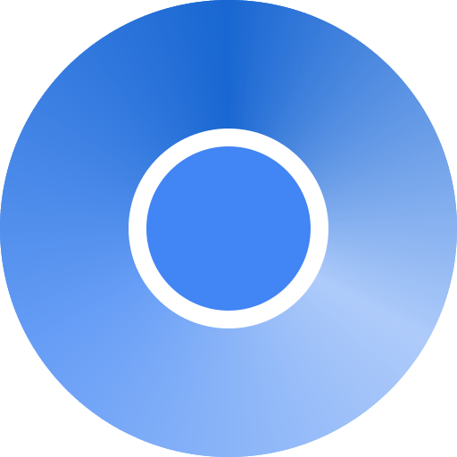
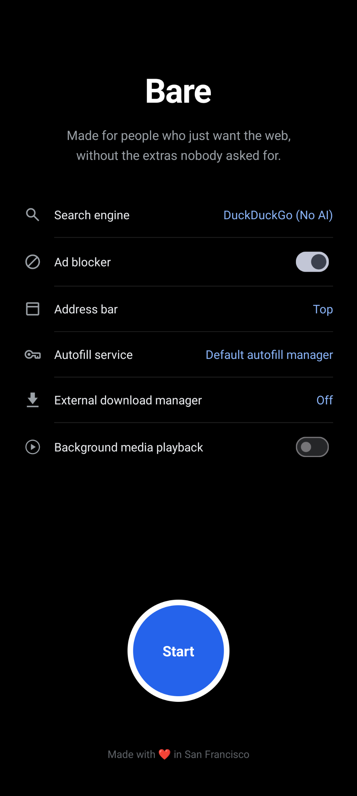
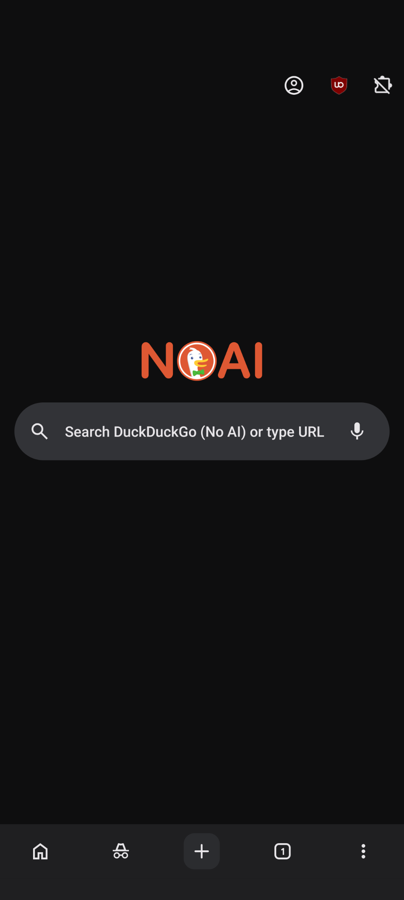
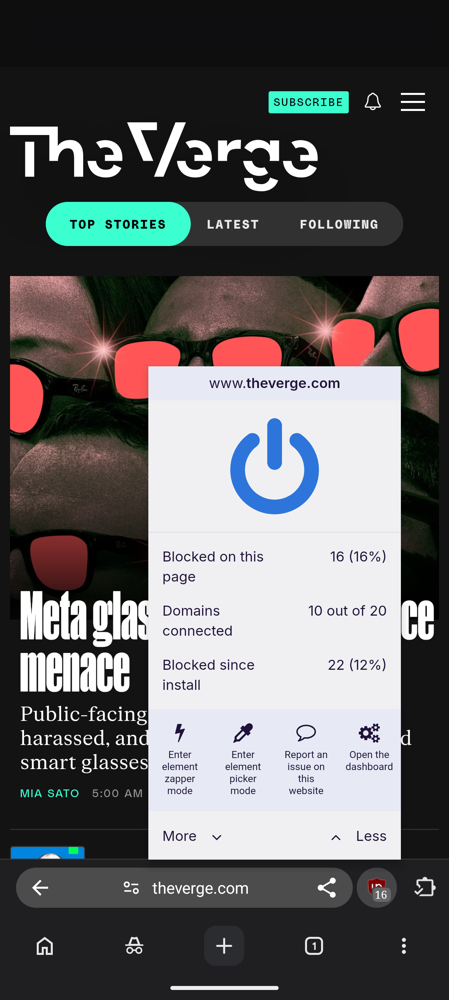
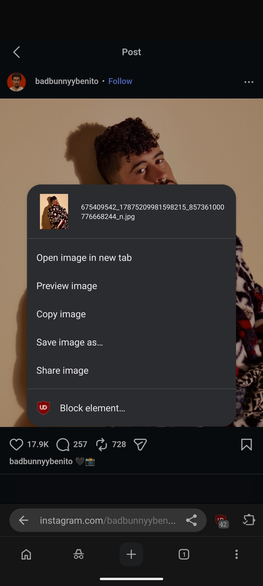
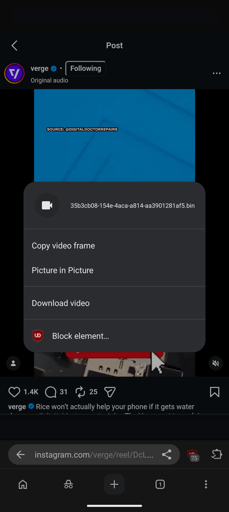
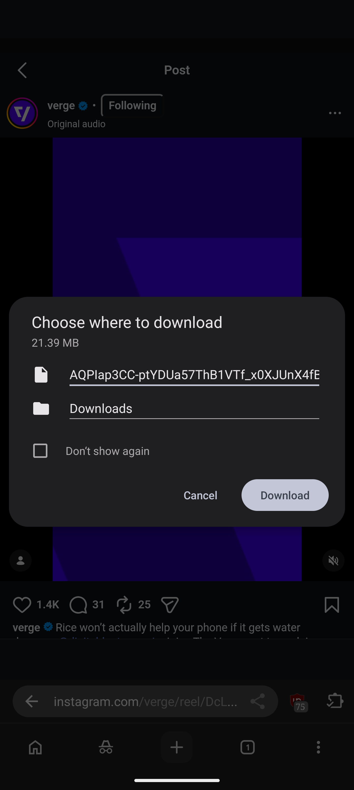

<div align="center">



# Bare Browser

**Shaped by the community**

**Extensions. Privacy. Freedom**

[barebrowser.org](https://barebrowser.org) · installs as `org.barebrowser`

</div>

---

**A browser with the extras taken out.** Bare is a patch series on **Chromium Desktop
Android** that removes Google tracking, telemetry and AI integration while keeping browser
extensions and video playback working.

Built and used on a Pixel 10 Pro XL. Not affiliated with Google or the Chromium project.

- **Base:** Chromium `153.0.7999.0` (commit `945b5115`)
- **Target:** `is_desktop_android = true`, `target_cpu = "arm64"`
- **Version:** `1.0.0-alpha.1`, versionCode `801000001`
- **Size:** 68 patches, 4741 insertions across 194 files

## What you get

**🧩 Real browser extensions on your phone.** Password managers, ad blockers, dark mode — the same
extensions you'd use on a desktop. Tap an extension's icon and its window opens properly, and you
can pin the ones you use most to the toolbar.

**🚫 uBlock Origin, already installed.** The full version, not Lite. Full uBO needs Manifest V2,
which Chrome has removed and Bare keeps working, so the filter lists and the element picker all
do what they do on a desktop. It is not pinned and you can disable or remove it like anything
else you installed yourself.

**⬇️ Save the media a page is playing.** Long press an audio player or a video and Bare offers to
download it. That includes sites that stream video in pieces rather than linking to a file, where
a browser normally offers nothing at all, because Bare remembers what the page fetched. Downloads
go out through the ordinary download path, external download manager included.

**🔗 Links open in the browser, not in apps.** Tapping a Reddit or YouTube result keeps you in the
browser instead of throwing you into their app mid-read. Phone numbers and email links still open
the right app, as they should.

**📵 De-Googled!** No background check-ins to Google, and nothing about the forms you fill in gets
sent off for analysis. Google's built-in AI features are removed entirely, not just switched off.

**🦆 DuckDuckGo out of the box.** The shipped default on a new profile, not something you have to
go and change. The new tab page follows it, so the Google logo is gone too.

**🧹 No dead Google UI.** Settings opens straight to what you can actually change — no sign-in
prompts, no Google services page, no password manager row that only says it stopped working. No
first-run sign-in screen either: it opens straight to a new tab.

**🎬 Video still works, and fullscreen behaves.** Ordinary video plays, and the proprietary codecs
that usually go missing from a privacy-focused build are present. Protected streaming is the one
thing not proven: Widevine is detected, but paid playback has not been exercised end to end, so
treat Netflix and the like as untested rather than working. Fullscreen
respects your rotation lock instead of forcing landscape, and fills the screen properly rather than
sitting off-centre next to the camera cutout.

**🌙 Dark stays dark.** On a dark theme, loading a page used to flash white first, which is
glaring on an OLED screen at night. Three separate parts of the browser defaulted to white before
a page painted; all three now follow your theme. There is also a setting to have Bare darken
light sites itself, off by default.

**🔎 Add your own search engine.** Chromium ships an add-engine screen on Android but leaves it
switched off. It is on here, under Settings > Search engine > Manage search engines and site
search: give it a name, a keyword and a URL, then make it your default. Handy for front ends
like noai.duckduckgo.com that no browser lists by default.

**🛡️ Still safe to browse.** Protections against fake certificates and downgraded connections are
deliberately kept. Privacy here doesn't come at the cost of security.

**🐛 Two crashes fixed.** The stock build crashes when you open an extension's window, and again if
you tap sign-in. Both are fixed.

## Screenshots

| | |
| --- | --- |
|  |  |
| **It asks before it assumes.** The welcome screen sets your search engine, ad blocker, address bar position and download handling up front, and nothing loads until you choose. | **A new tab with nothing on it.** No Google logo, no Discover feed, no promo cards. The search box is whichever engine you picked. |
|  |  |
| **uBlock Origin, the full version.** Not Lite. The dashboard, the element picker and the counts all work, because Bare keeps Manifest V2 alive. | **Save an image anywhere.** Sites that cover their images with an invisible layer normally defeat the long press. Here it still finds the image. |
|  |  |
| **Download video a page only streams.** The element points at a blob with no file behind it, so a browser normally offers nothing. Bare offers the file the page actually fetched. | **Straight to your downloads.** The real file, at full size, through the ordinary download path and your external download manager if you use one. |

## Why

Chromium's Desktop Android build supports real browser extensions, which mobile Chrome does
not. That makes it a genuinely better browser to live in — but it still ships Google's AI
stack, phones home on a schedule, and hands your links to other apps. Bare fixes that as a
patch series rather than a fork, so every change stays readable and reviewable.

## What the patches do

| # | Patch | Effect |
| --- | --- | --- |
| 0001 | Fix two Desktop Android crashes | Extension popup keyboard events and the sign-in Add Account action both crashed the browser |
| 0002 | Harden extensions menu | The menu action crashed when no toolbar coordinator existed |
| 0003 | Extensions toolbar on phone layouts | Extension icons, popups, and pinning were tablet-only; now available at phone widths |
| 0004 | Remove variations and network-time callbacks | Two periodic requests to Google, sent regardless of activity |
| 0005 | Keep web navigations in the browser | `http(s)` links no longer get handed to whichever app claims the domain |
| 0006 | Stop Autofill crowdsourcing uploads | Form structure was uploaded to Google to train its field-classification heuristics |
| 0007 | Remove the GCM push channel | Google Cloud Messaging services, the c2dm permission and the Firebase receiver |
| 0008 | Guard omnibox vector icon calls | Unblocks disabling the Google XR SDKs, which previously broke the build |
| 0009 | Hide Google Password Manager and sign-in promo | Both were permanently non-functional and advertised as broken |
| 0010 | Remove the "You and Google" settings section | Sign-in and Google services entries, neither of which can work here |
| 0011 | Ignore page requests to lock screen orientation | Fullscreen video forced landscape, overriding the system rotation lock |
| 0012 | Draw fullscreen content into the display cutout | Fullscreen video was letterboxed off the camera edge, leaving it off-centre |
| 0013 | Size fullscreen video to its picture | The seekbar sat at the bottom of the screen instead of on the video |
| 0014 | DuckDuckGo as the default search provider | Google was the shipped default, selected by engine ID rather than list order |
| 0015 | Remove the sign-in first-run screen | Promoted a sign-in this build cannot do, and claimed data is sent to Google |
| 0016 | Stop showing the NTP sign-in card | "Get better content" — sign in to personalise a feed this build cannot use |
| 0017 | Remove the Chrome tips module | A carousel of Google promos: history sync, sign-in, passwords, Safe Browsing |
| 0018 | Never offer the web app restore promo | Restores apps from devices "connected to this account" — impossible here |
| 0019 | Remove the Ask Gemini button | The bottom bar's extra slot resolved to Gemini, which demands account verification |
| 0020 | Remove the avatar sign-in button | "Signed out. Opens options to sign in." on every new tab page |
| 0021 | Stop offering Gemini as a toolbar shortcut | Otherwise the button removed in 0019 could be put back from Settings |
| 0022 | Offer downloads to an installed download manager | Hands a download to an app such as 1DM instead of fetching it in the browser |
| 0023 | Add a setting to choose the download manager | Settings → Downloads, off by default |
| 0024 | Browse the Chrome Web Store as a desktop site | The mobile store has no install button, so extensions could not be installed |
| 0025 | Turn off the AI Mode omnibox button | An AI entry point in the omnibox, on by default |
| 0026 | Hide the shortcuts row and NTP cards by default | Both already had toggles; only the starting state changed |
| 0027 | Lower the search box into thumb reach | Sits around 40% down the page rather than near the top |
| 0028 | Move the tab switcher toolbar to the bottom | Its buttons stayed at the top while the browsing toolbar sits at the bottom |
| 0029 | Pick which download manager receives downloads | Lists installed handlers, or ask every time |
| 0030 | Add an incognito toggle to the bottom bar | Fills the slot 0019 emptied; red while incognito is active |
| 0031 | Reword the toolbar shortcut window width note | "Only available for small windows" read as excluding phones |
| 0032 | Lower the search box to the middle of the screen | 40% was still higher than a thumb comfortably reaches |
| 0033 | Stop painting white while a page loads on a dark theme | Three surfaces defaulted to white; adds the darken-websites setting |
| 0034 | Default the toolbar shortcut to Share | It defaulted to "based on your usage", which moves the button as habits change |
| 0035 | Let the user add their own search engine | Chromium's add-engine screen existed but was switched off on Android |
| 0036 | Remove the built-in Gemini and AI Mode shortcuts | @gemini and @aimode shipped as search shortcuts pointing at Google |
| 0037 | Round the search engine icon in the omnibox | The rounding provider was built and updated but never attached to the view |
| 0038 | Rename the browser to Bare | Launcher, widgets, About page and the menu description |
| 0039 | Use the Bare icon | Legacy, adaptive and monochrome variants in every density |
| 0040 | Stop badging settings rows as new | "New" appeared beside Address bar and Appearance on every fresh profile |
| 0041 | Skip the first run experience | It opened a second Activity that only showed a spinner |
| 0042 | Add the Bare welcome screen | One-time welcome layered over the browser, not its own Activity |
| 0043 | Let supported sites keep playing media in the background | Opt-in, off by default; the page is told it is still visible so it does not pause itself |
| 0044 | Rename the browser in the remaining Android strings | 337 strings still said Chrome; Google's own products keep their names |
| 0045 | Remove the Autofill AI and personal context settings | "Smarter form understanding" shared page URLs and content with Google |
| 0046 | Use the installed password manager by default | And relabel the built-in option, which claimed to use your Google Account |
| 0047 | Animate a new tab from the button that opened it | From the tab switcher it grew from the top corner, ignoring the bottom bar |
| 0048 | Keep the search engine icon round in thumbnails | Outline clipping is skipped when a view is drawn into a software canvas |
| 0049 | Add a Video autostart site setting | Chromium stored an autoplay setting nothing ever read |

Patches 0001 and 0002 are bug fixes that happen to be prerequisites. 0003 is a usability fix.
0004 through 0010 are the de-Googling, as are 0014 through 0021. 0011 through 0013 fix
fullscreen video behaviour. 0022 and 0023 add the external download manager option. 0024
through 0028 are usability changes: the Web Store, the AI Mode button, what the new tab page
shows by default, and where the toolbars sit. 0029 through 0033 continue in that vein: choosing
the download manager, the incognito toggle, clearer wording in settings, where the search box
sits, the white flash on a dark theme, which shortcut the toolbar starts with, and adding your
own search engine. 0036 drops the built-in Google AI search shortcuts and 0037 fixes the shape
of the engine icon in the omnibox. 0038 through 0042 are the rebrand to Bare, and 0044 finishes
the naming the first pass missed. 0043 adds background media playback. 0045 and 0046 continue
the de-Googling in autofill: removing the AI sections, and defaulting to whichever password
manager the user already has. 0047 and 0048 are small visual fixes found by using the build:
where a new tab animation starts, and an icon that was clipped round rather than drawn round.

Sign-in has no single gate in Chromium. Patches 0009, 0010, 0015, 0016 and 0020 each remove a
different entry point — the settings row, the "You and Google" section, the first-run screen,
the New Tab Page card, and the toolbar avatar. Assume there are more rather than fewer.

### Removed by build flag

These go in `args.gn` rather than a patch:

```gn
use_mlkit_for_aicore = false          # ML Kit + AICore (on-device Gemini Nano bridge)
enable_glic_internal_resources = false # Gemini-in-Chrome surface
enable_reporting = false               # Reporting API / Network Error Logging
enable_service_discovery = false       # local device discovery
enable_mdns = false                    # mDNS

chrome_public_manifest_package = "org.barebrowser"  # application id
```

The application id is a build argument rather than a patch, because upstream already exposes
it as one. Note that changing it means the app installs alongside an earlier build rather
than upgrading it: Android identifies apps by package, so tabs, extensions and settings do
not carry over.

### What is deliberately kept

| Kept | Why |
| --- | --- |
| Extensions (`enable_extensions_core`) | The entire point of the Desktop Android target |
| Proprietary codecs (`ffmpeg_branding = "Chrome"`) | H.264/AAC video playback |
| Widevine | DRM — removing it breaks paid streaming |
| Component updater | Delivers CRLSet certificate revocation data |
| HSTS preload list | Static security asset, no callback |

## Requirements

- Docker, with at least **32 GB** allocated to the VM. At 16 GB a full build is
  reliably OOM-killed partway through.
- ~100 GB free disk. The Chromium checkout alone is ~50 GB.
- An arm64 Android device for testing.

Builds run in an x86-64 Ubuntu 22.04 container. On Apple Silicon this means Rosetta
emulation, and a full build takes hours.

## Quick start

```bash
./builder.sh build     # build the container image
./builder.sh start     # start it
./builder.sh shell     # get a shell inside
```

Fetch a Chromium checkout at the base commit into the container's `/work/chromium/src`, then
apply the series:

```bash
git am /exchange/patches/*.patch
```

Add the flags above to `out/<name>/args.gn` alongside your platform args, then:

```bash
gn gen out/<name>
autoninja -C out/<name> -j 12 chrome_public_apk
```

See [BUILDING.md](BUILDING.md) for the full workflow, including how files move between the
container and the host.

## Verifying a build

**The build is reproducible.** Building the same source twice produces an APK whose contents are
identical byte for byte, so you do not have to trust the published binary — you can rebuild it
and compare.

One caveat, and it is the important one: releases are signed with Bare's own private key, so the
published file as a whole is **not** something you can reproduce. Nobody but the holder of that
key can produce that signature, which is the entire point of signing. What you can reproduce is
everything the build actually produced, which is every byte except the signature.
`tools/apk-content-hash.py` hashes exactly that, so two builds of the same source agree no matter
who signed them.

This was measured, not assumed. The same tree was built two ways:

| Build | How | SHA-256 |
| --- | --- | --- |
| `out/PixelFold` | incremental, with a day of history including an applied-then-reverted patch | `19577669…fb492d48` |
| `out/Verify` | clean, from nothing, in a differently-named directory | `19577669…fb492d48` |

Identical hashes, identical size, from a 6h15m clobber build against an incremental one. The
differing directory name matters: a build path leaking into a binary is the most common cause of
irreproducibility, and Chromium's [deterministic build
support](https://chromium.googlesource.com/chromium/src/+/main/docs/deterministic_builds.md)
holds here. Zip timestamps, the other usual cause, are already handled upstream: every entry is
stamped `2001-01-01 00:00` rather than build time.

That measurement was taken while builds were still signed with Chromium's checked-in debug key,
which every build shares, so the APKs matched whole. They no longer do, and should not.

### To verify a build yourself

1. Check out Chromium at base commit `945b5115`
2. Apply the series: `git am patches/*.patch`
3. Use the `args.gn` shown above
4. Append the version arguments: `tools/version.py gn >> out/<name>/args.gn`
5. `gn gen out/<name> && autoninja -C out/<name> -j 12 chrome_public_apk`
6. Compare against the release, ignoring who signed it:

       tools/apk-content-hash.py out/<name>/apks/ChromePublic.apk Bare-1.0.0-alpha.1.apk

A rebuild from the same commit should report identical contents. The version arguments matter:
they are written into the manifest, so a build without them differs from the release.

### What this does and does not prove

**Proven:** the build is deterministic in this container — directory names, build history, and
clobber-versus-incremental do not change the output.

**Not yet proven:** that a rebuild on *different* hardware, or in a container built at a
different time, produces the same bytes. `docker/Dockerfile` starts from `ubuntu:22.04` and
installs packages with `apt-get`, so the image drifts as upstream packages change. Chromium
ships a hermetic toolchain through `DEPS`, so the host package set most likely does not affect
the output — but that link is untested here, and a reproducibility claim is the wrong place for
"most likely". If you rebuild on your own machine and get a different hash, please open an issue;
that is the missing measurement.

### Checking who signed a build

Bare releases are signed with this certificate, and nothing else should be trusted as Bare:

    SHA-256  ae:2a:0e:7f:b7:a1:32:ec:51:7d:26:a8:e7:c8:3d:27
             5e:83:74:7b:0a:77:7d:4a:42:22:5b:1d:34:32:71:a0
    subject  CN=Bare Browser, O=Bare Browser, OU=Release
    key      RSA 4096

    apksigner verify --print-certs Bare-1.0.0-alpha.1.apk

**Releases before `v1.0.0-alpha.1` were signed with Chromium's debug key**, which is checked into
Chromium's tree and therefore public. Anyone can build an APK that installs as an update over
one of those. If you are running a Chromium Extend build, uninstall it rather than updating; a
Bare release cannot replace it anyway, because the signing identity deliberately changed.

### Release hashes

Each release publishes the SHA-256 of its APK. That confirms the file you fetched is the file
that was uploaded, and nothing more: it is self-attested, so on its own it proves nothing about
provenance. The rebuild comparison above is what does that, and the signing certificate is what
ties a build to Bare.

| Release | Line | Signed with | SHA-256 |
| --- | --- | --- | --- |
| v1.2 | Chromium Extend | Chromium debug key | `8fe506d5e89da5a8c4c8feff0e74d8151334ee820eccf1223ca4a044ddfb6d33` |
| v1.4 | Chromium Extend | Chromium debug key | `e70364b58f215c3a390fe92622d844112462ea21a604da15e77ec40f3e082105` |

The Chromium Extend releases are left published as the line Bare grew out of. Their hashes are
still good for checking a download, but their signatures mean nothing: the key is public.

## Status

**Verified on device.** No crashes across a full session. Extensions install and run
(Bitwarden, uBlock Origin Lite, Dark Reader, Bypass Paywalls Clean), popups open, pinning
works. Both original crash reproductions are gone. The shipped `AndroidManifest.xml` contains
zero references to ML Kit or AICore.

Patch 0005 is confirmed against a real in-page link tap: following a Reddit result from a search
page keeps you in the browser, with Reddit's own "Open App" prompt left unused.

Patches 0011 and 0012 are confirmed on device: fullscreen video follows the phone's orientation
instead of forcing landscape, and sits centred in both portrait and landscape. 0013 is confirmed
by geometry read off the running page, for both a 16:9 video and one taller than the viewport.

Patches 0014 and 0015 are confirmed on a **wiped profile**, which is the only honest test for
either: the new tab page shows DuckDuckGo and a query resolves to `duckduckgo.com`, and the
browser opens straight to the new tab page with no first-run screen — including after a force
stop and relaunch, which is what fails if the Terms of Service acceptance does not persist.

**Not fully verified.** Widevine is *detected* — a DRM test page reports `widevine` as the
available key system — but actual protected playback has not been exercised end to end.

## Known limitations

- **Extension popups can be cropped.** Extensions auto-size their popup to content and may
  request a width wider than a phone screen. `kMaxSize` in
  `chrome/browser/ui/android/extensions/extension_action_popup_contents.cc` is hardcoded to
  800dp. Two attempts to bound it failed; the second stopped popups rendering entirely, so
  both were reverted. Needs instrumenting rather than guessing.
- **The omnibox is squeezed** when several extensions are pinned. `ToolbarPhone` has none of
  the `ToolbarWidthConsumer` negotiation `ToolbarTablet` uses. Unpinning all but one extension
  works around it.
- **Patch 0005 is blunt.** All `http(s)` navigations stay in the browser. Some OAuth flows and
  deep links legitimately expect an app handoff and will no longer get one. Explicit schemes
  (`intent://`, `tel:`, `mailto:`, `sms:`) are untouched.
- **The DuckDuckGo default only applies to new profiles.** Patch 0014 seeds the default at
  first run. An existing profile has `kDefaultSearchProviderData` persisted and
  `DefaultSearchManager` prefers it, so upgrading over an older install keeps Google until you
  change it in Settings → Search engine.
- **The New Tab Page still has Discover.** The Google logo, the promo cards and the AI Mode
  button are gone; Discover remains.
- **External downloads lose your sign-in.** With "Use an external download manager" on, a file
  that requires you to be signed in will fail in the other app: the interception point in
  `ChromeDownloadManagerDelegate` carries no cookie. Passing credentials needs a different
  interception layer, not an extra argument. The setting's own summary says so.
- **Passkeys (WebAuthn) do not work.** `Fido.FIDO2_PRIVILEGED_API` is restricted to
  Google-signed browsers, so a self-built Chromium is refused with `ApiException: 17`. This is
  inherent to building Chromium yourself, not caused by any patch here — verified by
  reproducing it on an earlier build.
- **Web Push is gone**, as a consequence of removing the GCM channel in patch 0007.
- **Password managers need one setting turned on.** Chromium uses its own autofill by default
  and never consults Android's autofill framework, so Bitwarden, 1Password and similar are
  simply never asked. Turn on Settings → Autofill options → use another service and they work.
  This is upstream behaviour, not something these patches introduce; the availability check
  also refuses Google's own autofill service, so the path is third-party only.
- **A custom search engine has no logo on the new tab page.** Engines added by hand carry no
  logo image, so the page shows none. Cosmetic only.
- **A downloaded adaptive stream arrives as two files.** Sites that stream video split the sound
  into a separate track, so Bare offers the video and the audio as two downloads and leaves you
  to put them together. Joining them in the browser means demuxing and remuxing both, which is
  built out of pieces already in the tree but is not built yet.
- **Segmented HLS and DASH offer nothing.** A `.m3u8` or `.mpd` is a list of where the pieces
  are, and a lone `.ts` or `.m4s` segment is not playable on its own, so both are refused rather
  than handed over as a download that would disappoint. Assembling a segmented stream is the same
  missing job as above.
- **On a site that never reloads, the offered video may be one you scrolled past.** Feeds navigate
  without loading a new document, so what the tab fetched accumulates, and Bare offers whichever
  video it pulled the most of. Usually that is the one you watched. Not always.
- **DRM-protected media cannot be downloaded**, and nothing here tries. Everything Bare offers is
  a file the page already fetched in the clear.
- **The first incognito tab of a session is slow to appear**, showing a blank panel or a fade
  before it settles. Measured, understood, not yet fixed.
- **Third-party autofill can stop being offered** until you navigate away and back. Bitwarden has
  been seen to go quiet mid-session with no error anywhere; the silent early return that causes
  it is known, the reason it triggers is not.
- **arm64 only.** There is no build for armeabi-v7a or x86, so an older phone or an emulator
  cannot install it.

## Not done yet

Each has an exact file and line reference in [docs/stage-1-2.md](docs/stage-1-2.md):

- Safe Browsing — blocked by one un-gated call site in the Android JNI bridge
- Google XR SDKs (ARCore, Cardboard, VrCore, OpenXR) — blocked by three omnibox call sites;
  the flags are coupled in both directions and there is no GN-only configuration that works
- `build_with_model_execution`, `enable_supervised_users`, `enable_offline_pages` — each
  blocked by a single GN `assert()`
- The New Tab Page still carries an AI Mode button and Discover. Its Google logo is gone as a
  side effect of 0014 — the NTP logo follows the default search engine
- ARCore, Cardboard and Daydream manifest entries persist from library manifests, though their
  code is gone

### Already inert — no work needed

Worth knowing before anyone patches them: a public (non-Chrome-branded) Chromium build already
sends no usage metrics, no URL-keyed metrics and no crash reports, because upstream withholds
those endpoints from forks. Translate is likewise disabled without a Google API key. Details and
evidence are in [docs/stage-1-2.md](docs/stage-1-2.md).

## Repository layout

```
patches/            the patch series, applied in order
docker/             container image definition
docker-compose.yml  build environment
builder.sh          container wrapper
assets/             logo and the screenshots used in this README
tools/              version numbers, release signing, build comparison
VERSION             Bare's version, independent of Chromium's
third_party/        uBlock Origin as shipped, with its provenance
docs/design.md      design decisions and rationale
docs/stage-1-2.md   execution notes, diagnoses, and results
```

The Chromium checkout, build output, and APKs are not tracked — they live in a Docker volume
and would be far past GitHub's file size limits.

## License

The patches modify Chromium source and are therefore subject to Chromium's
**BSD-3-Clause** license. See the
[Chromium LICENSE](https://chromium.googlesource.com/chromium/src/+/main/LICENSE).

`assets/logo_bare_blend.svg` and `assets/logo_bare_blend.png` are the Bare mark and belong
to this project.

Chromium is a trademark of Google LLC. Bare is unaffiliated with Google or the Chromium
project, and is not Chromium.
